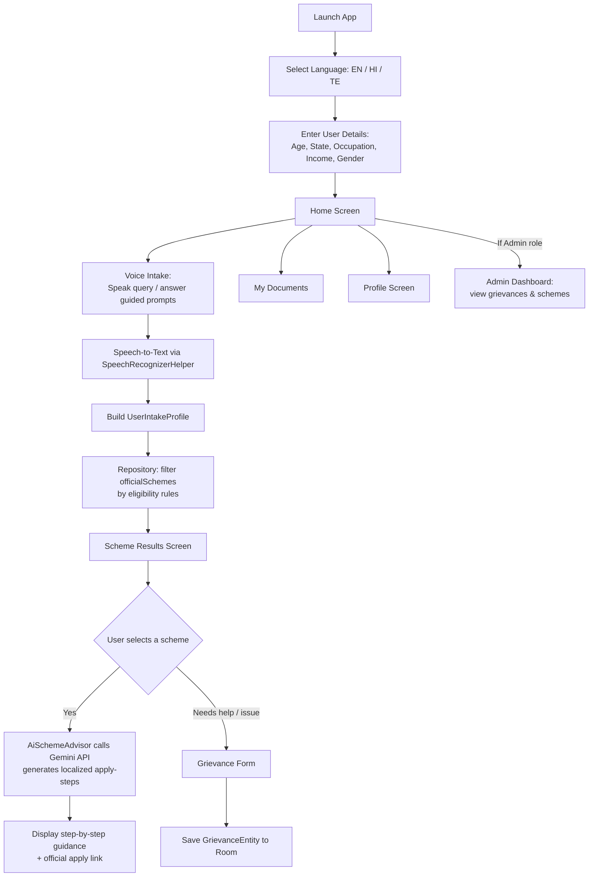
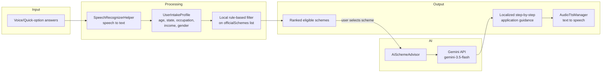

<div align="center">

</div>
Awaaz Setu

**आवाज़ सेतु — Voice-first, multilingual welfare scheme discovery and grievance filing for Indian citizens**

</div>

## Overview

Awaaz Setu bridges the gap between citizens and government welfare programs. Instead of navigating text-heavy government portals, users speak in their own language (English, Hindi, or Telugu) and the app matches them to relevant central and state welfare schemes, walks them through how to apply, and lets them file and track grievances.

## Methodology

The app follows a **profile-driven, AI-assisted matching approach** rather than a static form-to-database lookup:

1. **Language-first onboarding** — the user's spoken/preferred language is captured before anything else, so every subsequent screen, prompt, and AI response is localized.
2. **Structured voice intake** — instead of free-form voice queries, the app collects a fixed set of profile attributes (age, state, occupation, income bracket, gender) through guided voice/quick-option steps. This constrains the matching problem to a well-defined feature set.
3. **Rule-based pre-filtering** — schemes are first filtered locally against eligibility rules (age range, income ceiling, occupation, gender, state) already attached to each scheme record. This avoids sending every query to an external API and keeps eligible-only results deterministic and auditable.
4. **Generative step-by-step guidance** — once a citizen picks a scheme, the Gemini API is used only for the "how do I actually apply" explanation step, generating localized, numbered instructions. Matching stays rule-based; generation is used narrowly for guidance text.
5. **Local-first persistence** — profile, documents, and grievances are stored on-device (Room database + SharedPreferences for session) rather than requiring a backend, so the app works offline except for the AI guidance step.

## Architecture

The app follows an **MVVM (Model-View-ViewModel)** pattern on top of Jetpack Compose.

```
UI (Jetpack Compose Screens)
        │
        ▼
AwaazViewModel  ──────────────► AudioTtsManager / SpeechRecognizerHelper
        │                              (voice I/O)
        ▼
AwaazRepository ──────────────► AiSchemeAdvisor
        │                        (Gemini API — application guidance only)
        ▼
Room (AppDatabase / AppDao)
  - ProfileEntity
  - DocumentEntity
  - GrievanceEntity
```

### Layers

| Layer | Responsibility | Key files |
|---|---|---|
| **UI (Compose screens)** | Render each step of the flow, collect user input | `ui/screens/*.kt`, `ui/components/*.kt` |
| **ViewModel** | Holds `Screen` navigation state, `UserRole`, exposes `StateFlow`s to the UI, orchestrates voice I/O | `viewmodel/AwaazViewModel.kt` |
| **Repository** | Single source of truth for schemes, documents, grievances; bridges Room and in-memory scheme data | `data/repository/AwaazRepository.kt` |
| **AI layer** | Calls Gemini only to generate localized "how to apply" steps for a selected scheme | `data/ai/AiSchemeAdvisor.kt` |
| **Local persistence** | Room database for documents/grievances/profile; SharedPreferences for session/cache | `data/local/AppDatabase.kt`, `AppDao` |
| **Audio** | Speech-to-text intake and text-to-speech playback | `audio/SpeechRecognizerHelper.kt`, `audio/AudioTtsManager.kt` |

### Screen flow (state machine)

Navigation is driven by a `Screen` enum in the ViewModel, not a nav-graph library:

```
AUTH_LANGUAGE → USER_DETAILS_FORM → HOME ─┬─→ VOICE_INTAKE → SCHEME_RESULTS
                                           ├─→ GRIEVANCE_FORM
                                           ├─→ MY_DOCUMENTS
                                           ├─→ PROFILE
                                           └─→ ADMIN_DASHBOARD   (UserRole.ADMIN only)
```

## Flowchart — Citizen Journey



## Pipeline — Scheme Matching & Guidance



**Notes on the AI step:**
- The Gemini API key is read from `BuildConfig.GEMINI_API_KEY` and is only ever used for generating "how to apply" guidance for a scheme the user has already been matched to — it is never used for eligibility decisions.
- The prompt enforces a strict `step 1: ... step 2: ... end` format so the UI can reliably parse and render steps.
- If no valid API key is configured, this step is skipped gracefully rather than crashing.

## Tech Stack

- **Language:** Kotlin
- **UI:** Jetpack Compose
- **Architecture:** MVVM
- **Local storage:** Room (SQLite) + SharedPreferences
- **AI:** Google Gemini API (`gemini-3.5-flash`) via OkHttp REST calls
- **Build system:** Gradle (Kotlin DSL), version catalog (`libs.versions.toml`)

## Project Structure

```
app/src/main/java/com/example/
├── ui/
│   ├── screens/        # AuthLanguage, UserDetailsForm, Home, VoiceIntake,
│   │                   # SchemeResults, Grievance, Documents, Profile, AdminDashboard
│   └── components/     # AwaazBottomBar, AwaazLogoView
├── viewmodel/
│   └── AwaazViewModel.kt   # Screen state machine, role handling, orchestration
├── data/
│   ├── repository/
│   │   └── AwaazRepository.kt   # Scheme data + eligibility filtering
│   ├── ai/
│   │   └── AiSchemeAdvisor.kt   # Gemini API integration
│   └── local/
│       └── AppDatabase.kt       # Room DB (profile, documents, grievances)
└── audio/
    ├── SpeechRecognizerHelper.kt
    └── AudioTtsManager.kt
```

## Setup

**Prerequisites:** [Android Studio](https://developer.android.com/studio)

1. Clone the repo:
   ```
   git clone https://github.com/A-Zapps/Awaaz-settu.git
   ```
2. Open the project in Android Studio and let it sync.
3. Create a `.env` file in the project root and set your key:
   ```
   GEMINI_API_KEY=your_key_here
   ```
   (see `.env.example` — never commit your actual `.env` file)
4. Run the app on an emulator or physical device.

## Status

Actively in development as a team project at Woxsen University.

## License

MIT
<div align="center">